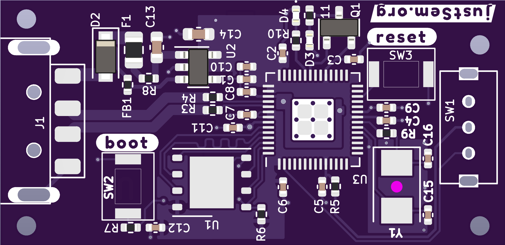

# badPico!
An [RP2040](https://www.raspberrypi.com/products/rp2040/) mini-sized BadUSB clone

_Size: 19x39mm_

This tiny (19x34mm) device is just a common "Rubber Ducky" clone.

Without software this is just an RP2040-on-a-stick ;)

# Usage
A good starting point for this board is the [BadPico Repository](https://github.com/EvgeniGenchev/BadPico) by @EvgeniGenchev.

The board in general works identical to a Raspberry [Pi Pico](https://www.raspberrypi.com/products/raspberry-pi-pico/) and can be programmed as such.
However, due to the intended use-case the I/O pins are not available for usage with the exception of those listed below.

# PinOuts

| Designator	| GPIO  |  Type 	| Description 							|
|-------------------------------------------------------------------------------------------------------|
|  D4		| 25	| LED		| Status LED  							|
|  D3		| 24	| LED		| User-programmable LED 					|
| SW1		| 0	| Switch	| User-programmable switch. I use it as an 'arming' switch 	| 

# Bill of Materials (BoM)
| Name	| Designator	| Footprint	| Manufacturer		| Man. Part No.			|
|-----------------------------------------------------------------------------------------------|
| 27pF	| C15,C16	| C0402		| FH			| 0402CG270J500NT		|
| 100nF | C1-C9,C12	| C0402		| Yaego			| CC0402KRX7R7BB104		|
| 1uF	| C10,C11	| C0402		| Samsung		| CL05A105KQ5NNNC		|
| 10uF	| C13,C14	| C0603		| Samsung		| CL10A106MP8NNNC		| 
| Y	| Y1		| 5032		| Abracon		| ABMM2-12.000MHZ-E2-T 		|
| 24.7R	| R3,R4		| R0402		| FH			| RC-02W27R4FT 			|
| 330R	| R5		| R0402		| FOJAN			| FRC1206J331			|
| 1k	| R7,R9,R10,R11	| R0402		| Walsin		| MR04X102			|
| 100k	| R8		| R0402		| FH			| RS-03K104JT			|
| Flash	| U1		| WSON-8	| Winbond Elec		| W25Q128JVPIQ			|
| LDO	| U2		| TSOT-23-5	| Maxlinear		| SPX3819M5-L-3-3		|
| RP2040| U3		| QFN-56	| Raspberry Pi		| RP2040			|
| FET	| Q1		| SOT-24	| Vishay		| Si2319CDS			|
| Diode	| D2		| SOD_123F	| Shandong		| 1N4002W			|
| LEDs	| D3,D4		| D0402		| Everlight		| 17-21/BHC-XL2M2TY/3T		|
| Fuse	| F1		| F0805		| LittelFuse		| 0805L050WR			|
| Bead	| FB1		| F0402		| Chillsin		| BBSY00100505101Y00		|
| USB	| J1		| Custom	| XKB Connectivity	| U217-041N-4BV81 		|
| SWT	| SW2,SW3	| Custom	| ALPS			| SKRKAEE020			|
| SWF	| SW1		| Custom	| Shou Han		| SK12D07VG4			| 

